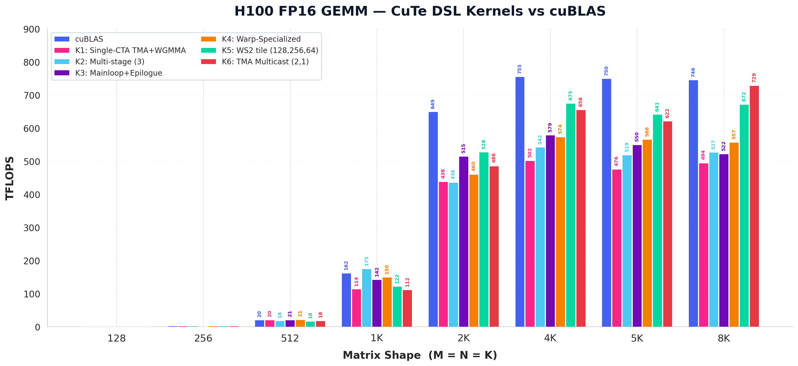
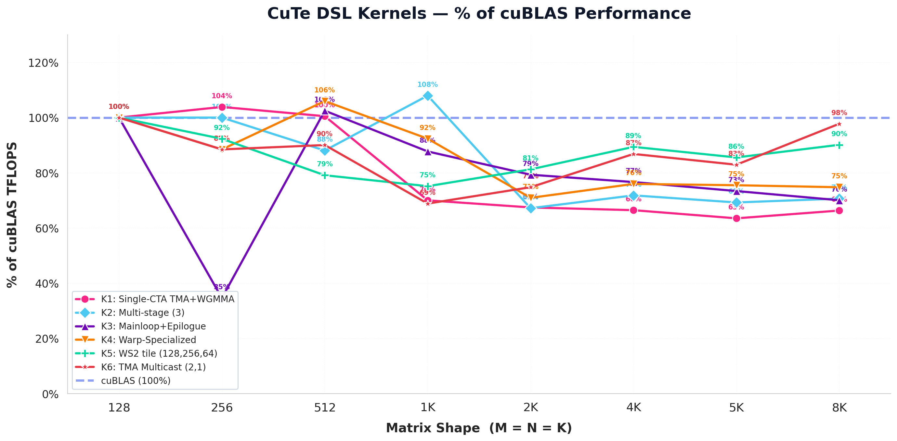
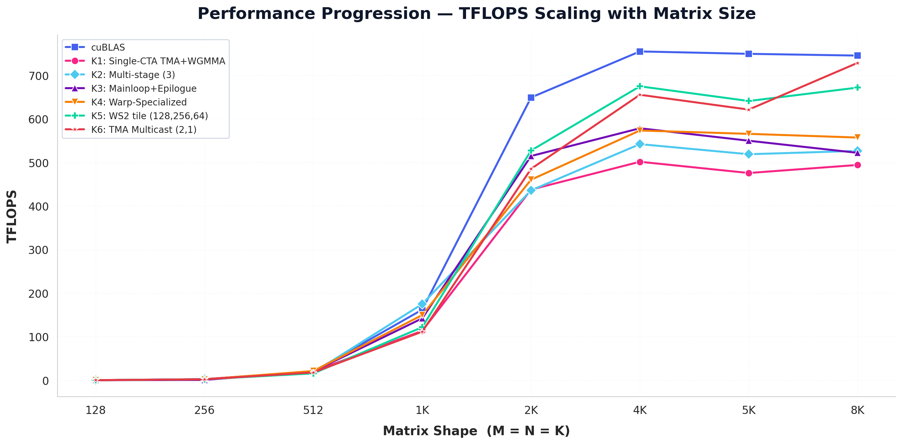

# H100 GEMM Benchmark — CuTe DSL vs cuBLAS

**GPU:** NVIDIA H100 80GB HBM3 (sm_90a, 132 SMs)
**Precision:** FP16 Tensor Core (WGMMA)
**Shapes:** M = N = K in {128, 256, 512, 1024, 2048, 4096, 5120, 8192}
**Tile:** 128x128x128 (K1–K4), 128x256x64 (K5, K6)

---

## Results

### TFLOPS



### % of cuBLAS



### Performance Progression



---

## Results Table (TFLOPS)

| Shape | cuBLAS | K1 | K2 | K3 | K4 | K5 | K6 |
|-------|--------|----|----|----|----|----|----|
| 128 | 0.3 | 0.3 | 0.3 | 0.3 | 0.3 | 0.3 | 0.3 |
| 256 | 2.6 | 2.7 | 2.6 | 0.9 | 2.3 | 2.4 | 2.3 |
| 512 | 20.1 | 20.2 | 17.7 | 20.6 | 21.3 | 15.9 | 18.1 |
| 1024 | 162.1 | 113.5 | 175.0 | 142.2 | 149.7 | 121.8 | 111.6 |
| 2048 | 649.3 | 437.9 | 436.1 | 514.9 | 460.5 | 527.5 | 485.5 |
| 4096 | 755.0 | 501.7 | 542.2 | 578.6 | 573.5 | 674.9 | 655.5 |
| 5120x5120x4096 | 749.5 | 475.9 | 519.0 | 550.0 | 565.8 | 641.2 | 621.5 |
| 8192 | 745.5 | 494.4 | 526.7 | 522.2 | 557.3 | 672.0 | 728.8 |

## Results Table (% of cuBLAS)

| Shape | K1 | K2 | K3 | K4 | K5 | K6 |
|-------|----|----|----|----|----|----|
| 128 | 100% | 100% | 100% | 100% | 100% | 100% |
| 256 | 104% | 100% | 35% | 88% | 92% | 88% |
| 512 | 100% | 88% | 102% | 106% | 79% | 90% |
| 1024 | 70% | 108% | 88% | 92% | 75% | 69% |
| 2048 | 67% | 67% | 79% | 71% | 81% | 75% |
| 4096 | 66% | 72% | 77% | 76% | 89% | 87% |
| 5120 | 63% | 69% | 73% | 75% | 86% | 83% |
| 8192 | 66% | 71% | 70% | 75% | 90% | 98% |

---

## Kernel Descriptions

### cuBLAS (Reference)
PyTorch `torch.matmul` FP16 path. Uses cuBLAS's internal tiling, warp specialization, and Hopper-specific optimizations.

### K1: Single-CTA TMA + WGMMA (1 stage)
Baseline Hopper GEMM. One CTA per output tile. TMA loads A/B from global → shared memory. WGMMA computes the dot product. Direct register → global memory store.

**Bottleneck:** Single-stage means no overlap between memory and compute. Load latency is fully exposed on the critical path. At 1K+, the lack of pipelining costs ~30% vs cuBLAS.

**Shared memory:** 64 KB — sA (128×128×2B = 32 KB) + sB (128×128×2B = 32 KB).

### K2: Multi-stage TMA + WGMMA (3 stages)
Same TMA+WGMMA mainloop as K1, but with a 3-stage software pipeline via `PipelineTmaAsync`. The producer warp prefetches K-tiles into 3 SMEM buffers while consumer warps compute on previously loaded tiles.

**How the pipeline works:** The TMA warp runs ahead of the MMA warps. With `num_stages=3`, it fills 3 SMEM slots before the first MMA starts. When MMA finishes stage 0, it releases the barrier → TMA warp wakes up and loads the next tile into that slot.

**Shared memory:** 192 KB — sA (128×128×3×2B = 96 KB) + sB (128×128×3×2B = 96 KB).

### K3: Mainloop + Epilogue pipeline (3+4 stages)
Same 3-stage mainloop as K2, but adds a dedicated `PipelineTmaStore` epilogue with 4 pipeline stages. After WGMMA, accumulators are written to shared memory (via `stmatrix`), then TMA stores drain them to global memory asynchronously.

**Epilogue flow:** MMA warps write accumulators → `stmatrix` → sC (shared memory, aliased to sA's buffer). Fence + sync_threads. TMA warp reads sC → TMA store → gC (global memory, 4-deep pipeline).

**Shared memory:** Adds 48 KB barrier storage for the epilogue pipeline on top of the mainloop's 192 KB.

### K4: Warp-Specialized TMA + WGMMA (3+3 stages)
Strict warp specialization: 1 dedicated TMA producer warp + 2 MMA consumer warp groups. Same 3-stage mainloop, but the MMA partitioning and epilogue use the warp-specialized pattern.

**Architecture:** TMA warp (warp 8) is dedicated to issuing TMA loads. MMA warps (warps 0–7) are dedicated to WGMMA. The separation eliminates warp-level contention and improves register allocation.

### K5: Warp-Specialized tile (128, 256, 64), 4 stages
Same warp-specialized architecture as K4, but changes the CTA tile from square (128,128,128) to asymmetric (128,256,64) and increases pipeline depth to 4 stages.

**Why asymmetric tiles:** The (128,256,64) tile has 2× the N-dimension width and ½ the K-dimension depth. Higher arithmetic intensity, better SMEM banking, and less L2 cache thrashing. The 4-stage pipeline hides TMA latency across the entire K dimension.

**Shared memory:** 192 KB — sA (128×64×4×2B = 64 KB) + sB (256×64×4×2B = 128 KB).

### K6: TMA multicast cluster (2, 1), 4 stages
Same (128,256,64) tile and 4-stage pipeline as K5, but uses a 2×1 CTA cluster with `CopyBulkTensorTileG2SMulticastOp`. One CTA issues a TMA load; the hardware multicasts the data to both CTAs in the cluster.

**How TMA multicast works:** In a 2×1 cluster, CTA 0 issues a TMA load for its A tile. The H100's TMA unit hardware-copies the same data to CTA 1's SMEM buffer. This halves the global memory bandwidth demand for A.

---

## Running

```bash
# Benchmark all kernels on Modal H100
modal run scripts/cute_dsl/run.py::main --task H100/scripts/benchmark_all.py --gpu H100

# Generate charts locally
python kernels/cute_dsl/H100/scripts/plot_results.py
```

---

## Profiling with Nsight Compute (ncu)

Capture a full-detail NVIDIA Nsight Compute report (`.ncu-rep`) and open it
in your local Nsight Compute GUI — no local GPU needed. Only the report file
is written, to the path you give `-o`:

```bash
ncu --set full --warp-sampling-interval auto --clock-control base \
    --launch-skip 1 --launch-count 1 \
    -o out/k6.ncu-rep python3 kernels/cute_dsl/H100/kernels/6_wgmma_tma_multistage_WS2_multicast.py
```

On Modal (no local GPU) — download only the `.ncu-rep`:

```bash
modal run scripts/ncu_capture.py \
    --src kernels/cute_dsl/H100/kernels/6_wgmma_tma_multistage_WS2_multicast.py --gpu H100
modal volume get gpulab-cute-dsl-traces captures/6_wgmma_tma_multistage_WS2_multicast.ncu-rep ./k6.ncu-rep
```

Open it locally: `ncu-ui k6.ncu-rep` (or File → Open in the Nsight Compute
GUI) — ncu only needs the GPU at capture time.

---

*Benchmarked on Modal H100 80GB. Generated by `benchmark_all.py` + `plot_results.py`.*
